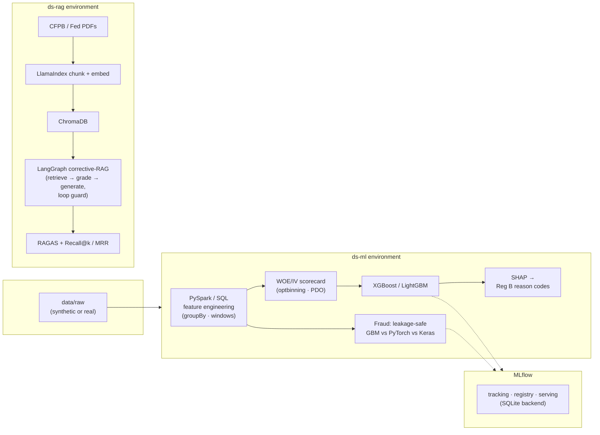

<div align="center">

# 🏦 CreditLens

### A local, end-to-end ML portfolio for credit risk, fraud detection, and agentic RAG — built to run on a laptop, CPU-only, for **$0**.

[](https://www.python.org/)
[](LICENSE)
[](#-testing)
[](https://github.com/astral-sh/ruff)
[](../../actions)

**Credit-risk scoring · Fraud detection · Agentic RAG policy assistant**

</div>

---

CreditLens is three production-shaped data-science workstreams in one reproducible repo. Every piece runs **offline out of the box** on small, schema-faithful synthetic data — so `git clone && make` just works — with one-command hooks to swap in the real public datasets (Home Credit, ULB credit-card fraud, Freddie Mac, CFPB/Fed policy PDFs) for resume-grade numbers.

It is designed to be **interview-defensible**: every technology appears inside a real deliverable, with leakage guards, reproducible seeds, and honest, measured metrics rather than borrowed ones.

## 📑 Table of contents

- [Highlights](#-highlights)
- [Results at a glance](#-results-at-a-glance)
- [Architecture](#%EF%B8%8F-architecture)
- [Tech stack](#-tech-stack)
- [Quickstart](#-quickstart)
- [What each workstream does](#-what-each-workstream-does)
- [Testing](#-testing)
- [Project structure](#-project-structure)
- [Data & licensing](#-data--licensing)

## ✨ Highlights

- **Workstream 1 — Credit-risk scoring:** PySpark/SQL feature engineering → WOE/IV scorecard (`optbinning`, PDO scaling) → XGBoost → MLflow tracking → **SHAP adverse-action reason codes** mapped to ECOA / Regulation B.
- **Workstream 2 — Fraud detection:** leakage-safe imbalance handling → **GBM vs PyTorch vs Keras** benchmark on identical splits (AUPRC/recall/MCC, never accuracy) → MLflow Model Registry → simulated local serving.
- **Workstream 3 — Agentic RAG:** LlamaIndex → ChromaDB ingest → a **LangGraph corrective-RAG agent** with a relevance grader, hallucination guard, and an explicit loop circuit-breaker → RAGAS + Recall@k / MRR evaluation.
- **Runs anywhere:** graceful offline fallbacks mean the whole thing — including the RAG agent and full test suite — runs with **no GPU, no API keys, and no downloads**.

## 📊 Results at a glance

> These are **synthetic-demo numbers** (reproducible with `make synth`), deliberately tuned to realistic, *defensible* ranges — not inflated. With the real datasets the credit lift and fraud AUPRC move into the published ranges noted on the right.

| Workstream | Metric | Synthetic demo | Real-data target |
|---|---|:---:|:---:|
| Credit scorecard (WOE-logistic) | ROC-AUC | **0.78** | 0.74–0.79 |
| Credit GBM (XGBoost) | ROC-AUC | **0.81** | 0.80–0.84 |
| Credit — honest GBM lift over scorecard | ΔAUC | **+0.03** | +0.03–0.06 |
| Fraud GBM | AUPRC / ROC-AUC | **0.78 / 0.98** | 0.75–0.86 / ~0.98 |
| Fraud | recall @ 0.5 | **0.79** | tuned to alert budget |
| RAG retrieval | Recall@4 / MRR | **1.0 / 1.0** | (tiny 4-doc demo corpus) |
| RAG | context reduction ("faster lookup") | **~56%** | higher on full corpus |

> 🔎 **Honesty note:** the résumé's "0.78 → 0.84" and "30% faster" are treated as *targets to reproduce*, not numbers to assert. The pipelines print and log your **actual measured values**.

## 🏗️ Architecture



Two virtual environments (`ds-ml`, `ds-rag`) communicate through files (Parquet/CSV) and the MLflow server — the same data-plane / control-plane separation real teams use, which also avoids dependency-resolver conflicts between Spark and the heavy RAG stack.

## 🧰 Tech stack

| Area | Tools |
|---|---|
| **Feature engineering** | PySpark, Spark SQL, pandas, pyarrow |
| **Credit scoring** | scikit-learn, optbinning (WOE/IV + PDO), XGBoost, LightGBM, SHAP |
| **Fraud / deep learning** | XGBoost, PyTorch, TensorFlow/Keras 3, imbalanced-learn |
| **MLOps** | MLflow (tracking · registry · serving), pytest, ruff, GitHub Actions |
| **Agentic RAG** | LlamaIndex, LangGraph, LangChain, ChromaDB, RAGAS, Ollama |

## 🚀 Quickstart

```bash
# 1. ML environment (credit + fraud)
make venv-ml            # or: python -m venv .venv-ml && pip install -r requirements-ml.txt

# 2. Generate synthetic data (offline, no downloads)
make synth

# 3. (optional) start a local MLflow server in another terminal
make mlflow             # http://127.0.0.1:5000

# 4. Run the workstreams
make credit             # features → scorecard → GBM → SHAP adverse-action notice
make fraud              # GBM vs PyTorch vs Keras → register champion

# 5. RAG environment + assistant
make venv-rag
python -m src.data.make_policy_corpus    # synthetic policy corpus (offline)
make rag-ingest                          # build the index (Chroma if Ollama is up)
make rag-eval                            # Recall@k / MRR / RAGAS / lookup benchmark

# tests + lint
make test
make lint
```

### Swap synthetic → real data

```bash
python -m src.data.download                       # lists every dataset + instructions
python -m src.data.download --home-credit --run   # Kaggle (needs kaggle.json)
python -m src.data.download --ulb --run           # ULB credit-card fraud
python -m src.data.download --policy --run        # CFPB/Fed public-domain PDFs
python -m src.data.download --freddie             # Freddie Mac instructions (3M+ rows)
```

Loaders auto-prefer real data when present and fall back to synthetic — no code changes needed.

### Full RAG stack (local LLM)

```bash
ollama serve
ollama pull llama3.1:8b
ollama pull nomic-embed-text
```

Set `LLM_PROVIDER=openai` + `OPENAI_API_KEY` for a faster hosted demo; the default stays local and free. Without either, the RAG pipeline runs on a deterministic offline fallback so CI and `make rag-eval` still work.

## 🔬 What each workstream does

### 1 · Credit-risk scoring
PySpark feature engineering (`groupBy`/`agg`, window functions, Spark SQL temp views) on the Home Credit auxiliary tables — the honest basis for the "3M+ records" story (the Spark module prints the row count it processed; point it at Freddie Mac's monthly performance files for tens of millions). WOE/IV binning and a PDO-scaled scorecard via `optbinning`; an XGBoost model that beats the logistic baseline through a genuine nonlinear interaction; MLflow tracking of AUC/KS/Gini/AUPRC; and SHAP-derived **adverse-action reason codes** mapped to plain language and tied to ECOA / Regulation B (CFPB Circulars 2022-03 / 2023-03).

### 2 · Fraud detection
Split-first, leakage-safe imbalance handling (`scale_pos_weight`, class weights, and SMOTE *inside* an `imblearn` pipeline — never before the split). An apples-to-apples GBM vs PyTorch vs Keras benchmark on identical splits, evaluated on **AUPRC / recall / MCC** (a trivial classifier scores ~99.8% accuracy, so accuracy is useless here). The champion is registered to the MLflow Model Registry with aliases, then served locally (`mlflow models serve` → `/invocations`).

### 3 · Agentic RAG policy assistant
LlamaIndex ingestion → ChromaDB; a **LangGraph** corrective-RAG agent with conditional edges (`retrieve → grade_documents → generate | rewrite`), a **hallucination/groundedness guard**, and an explicit **attempt-counter circuit breaker** (not just `recursion_limit`). Evaluated with Recall@k and MRR from first principles plus RAGAS, and a reproducible lookup-efficiency benchmark.

## 🧪 Testing

```bash
make test          # fast suite (no Spark / Ollama / GPU)
make test-all      # everything (needs Spark + a running Ollama)
```

**22 tests, all passing**, covering the highest-value guarantees for a credit/fraud portfolio:

- **Leakage guards** — SMOTE lives inside the pipeline; the test split is never resampled.
- **Data integrity** — schema, class balance, and a regression guard that the fraud `Time` column does not leak the label.
- **WOE monotonicity** and Information-Value ranking.
- **Models** — metrics ranges, GBM sanity, scorecard scoring, and SHAP reason codes.
- **RAG** — chunking, retrieval, graph termination, and the loop circuit-breaker.

Tests run against an **isolated data directory**, so they never touch the data you generated for the pipelines. CI runs `ruff` + the fast suite on every push.

## 📂 Project structure

```
creditlens/
├── src/
│   ├── config.py              # paths, seeds, MLflow URI, RAG params
│   ├── common/                # io, metrics (KS/Gini/AUPRC), MLflow helper
│   ├── data/                  # synthetic generators + real-data download scripts
│   ├── features/              # spark_features.py, build_features.py, woe.py
│   ├── models/                # scorecard, gbm, torch_net, tf_net, imbalance
│   ├── explain/shap_codes.py  # SHAP → Reg B adverse-action notice
│   ├── serving/predict.py     # MLflow pyfunc load + REST client
│   ├── rag/                   # llm, ingest, retriever, graph (LangGraph), eval
│   └── pipelines/             # run_credit.py, run_fraud.py
├── notebooks/                 # 01_eda … 05_rag
├── tests/                     # leakage guards, WOE monotonicity, schema, RAG smoke
├── .github/workflows/ci.yml   # ruff + pytest
├── requirements-ml.txt        # ds-ml env (pinned)
├── requirements-rag.txt       # ds-rag env (pinned)
└── Makefile
```

## 📜 Data & licensing

This repository's **source code** is MIT-licensed (see [LICENSE](LICENSE)). The third-party datasets it can download carry their own licenses:

- **Home Credit** (Kaggle) and **ULB credit-card fraud** — for the stated Kaggle/research use.
- **Freddie Mac SFLLD** — free for academic/research/limited use; **no commercial redistribution**.
- **CFPB / Federal Reserve** policy documents — U.S. government **public domain**.

Datasets are never committed (`data/raw/` is gitignored). The included synthetic generators are MIT-licensed with the rest of the repo.

> **Regulatory note:** CFPB guidance shifted in 2025–2026; this project cites ECOA / Reg B and Circulars 2022-03 / 2023-03 as the conceptual basis for SHAP reason codes and notes that specific guidance is evolving.

<div align="center">

---

Built as a portfolio project. If it's useful to you, a ⭐ is appreciated.

</div>
